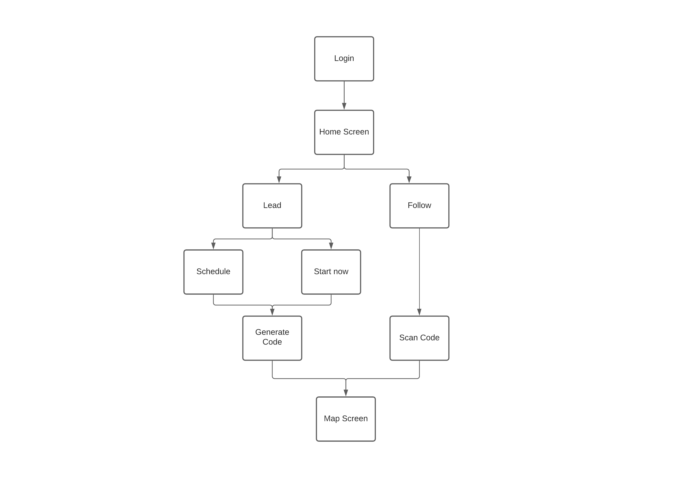

# Beacon App

This is a prototype for [CCExtractor's Beacon project](https://ccextractor.org/public/gsoc/beacon/). The idea of the project is the help group members follow their beacon who know's the way in situations like a hike or a city tour.

> Note: This is a very early prototype. UI might change a lot but flow would remain same.

## Prototype video

## Flow for the app

### Login

It is an **optional** screen as currently we want users to access anonymously.
I have considered login with email and OAuth

### Home Screen

From here one can select to lead or follow(i.e. create a group or join one).

### Create group (Beacon)

Beacon can create a group and start broadcasting their location or schedule their active time so it will be automatically activated and deactivated in the given time frame

### Join group (Follower)

After a beacon creates a group followers can join the group and they will get live location of beacon.

### Beacon and Follower handshake

There are a couple of ways doing this, but I have consider 3 of them:
1. Scan QR Code
2. Entering 6-digit numeric code
3. Sending links

### Map Page

As this is the page where user will stay the most so this is the most significant page. This page will show a slight change in case of Beacon or Follower.

#### Beacon side

- Beacons will have option to add another Beacon
- Deactivate session
- Add/remove markers on map
- See numbers of followers
- Share QR, code and link

#### Follower side

- Followers will get to see places marked by beacons
- Leave session
- Follow a specific beacon(for N beacon)

## Some other idea

- While beacon is adding a marker they can optionally add a description and a photo of that location.